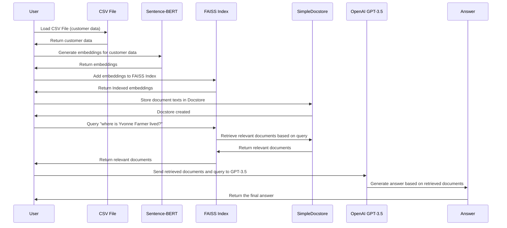

## Install
```python
pip install -r requirements.txt
```


### Sequence Diagram



---

### Detailed Explanation of the Flow:

1. **Step 1: Loading the CSV File**:
   - The script starts by loading customer data from a CSV file using Pandas. The data is combined into a single text format for each customer, containing details such as their name, company, location, and contact information. 

2. **Step 2: Sentence-BERT Embedding**:
   - The combined text from the CSV file is passed through the Sentence-BERT model (`all-MiniLM-L6-v2`). Sentence-BERT is a transformer-based model that generates embeddings (numerical representations) for each customer text.

3. **Step 3: FAISS Index Creation**:
   - The embeddings are stored in a FAISS index, which allows for efficient similarity-based searches. FAISS (Facebook AI Similarity Search) is designed to handle large datasets and quickly retrieve similar documents based on the embeddings.
  
4. **Step 4: Docstore Setup**:
   - A custom `SimpleDocstore` is created to store the original customer text documents. The Docstore is responsible for managing and retrieving documents when given a document ID.

5. **Step 5: Querying the FAISS Index**:
   - When a user provides a query (e.g., "where is Yvonne Farmer lived?"), the FAISS index retrieves the most relevant documents based on the similarity between the query and the customer text embeddings. The corresponding documents are retrieved from the Docstore using their IDs.

6. **Step 6: Answer Generation Using GPT-3.5**:
   - After the relevant documents are retrieved, they are concatenated into a context and passed to OpenAI's GPT-3.5 model. The query and context are provided as input to generate a concise and accurate answer.
   - The OpenAI API is used here for generating the final answer, ensuring a high-quality response.

7. **Step 7: Final Answer Returned**:
   - GPT-3.5 processes the input and returns the answer based on the documents it was provided. This answer is then displayed to the user.

### Summary of the Flow:

- The system first loads customer data from a CSV file, processes it into embeddings using Sentence-BERT, and stores the embeddings in a FAISS index for fast retrieval.
- When a user queries the system (e.g., asking about a specific customer), the FAISS index retrieves the most relevant customer documents based on the embeddings.
- These retrieved documents are then sent to OpenAI's GPT-3.5, which generates an answer based on the provided context.
- Finally, the generated answer is returned to the user.

---

### Key Components:

- **Sentence-BERT**: Generates embeddings for customer data, which are numerical representations of the text.
- **FAISS**: Stores the embeddings and efficiently retrieves similar documents based on user queries.
- **SimpleDocstore**: Stores and retrieves the actual text documents.
- **OpenAI GPT-3.5**: Processes the retrieved documents and query to generate a concise answer.

This approach ensures that the system can handle large-scale document retrieval and generate high-quality, contextually accurate answers.