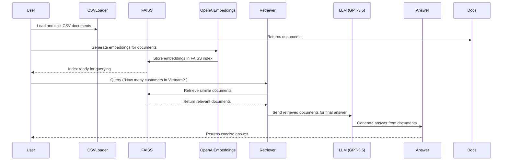
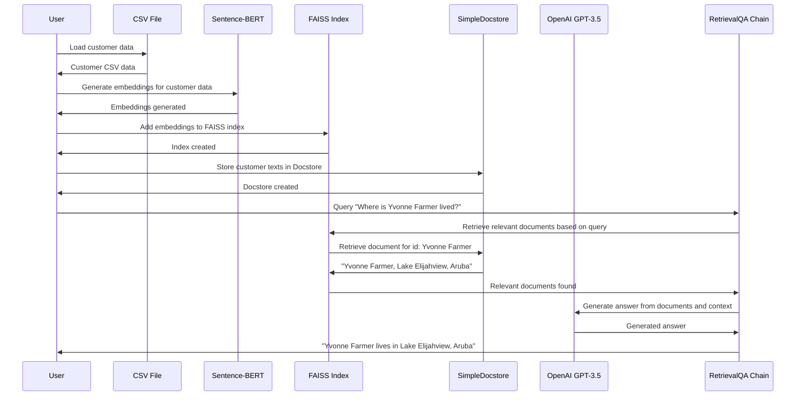

  
## OpenAI GPT with RAG Workflow (Retrieval-Augmented Generation)

## Sentence-BERT with FAISS and Simple Docstore Workflow

### Detailed Comparison of Two RAG
#### 1. **OpenAI GPT with RAG Workflow** (First Diagram)
   - **Document Loading**: The documents are loaded from a CSV file and split for processing.
   - **Embedding Generation**: OpenAI Embeddings are used to generate embeddings, which are stored in the FAISS index.
   - **Querying**: When the user submits a query, the retriever queries FAISS for similar documents based on embeddings.
   - **Answer Generation**: The retrieved documents (embeddings) are passed to OpenAI GPT-3.5, which generates a final answer using the document context.

#### 2. **Sentence-BERT with FAISS and Simple Docstore Workflow** (Second Diagram)
   - **Document Loading**: The user loads customer data from a CSV file.
   - **Embedding Generation**: Sentence-BERT (a pre-trained model from Hugging Face) is used to generate embeddings, which are stored in the FAISS index.
   - **Docstore Creation**: Alongside storing embeddings in FAISS, a custom **SimpleDocstore** is created to store the original customer text. Each document is wrapped in `Document` objects to preserve access to the original context.
   - **Querying**: A QA Chain retrieves relevant documents by querying FAISS and fetching the corresponding document text from the SimpleDocstore based on document IDs.
   - **Answer Generation**: The documents retrieved from the docstore are passed to OpenAI GPT-3.5 via the QA Chain, which generates the final answer using both the embeddings and original document content.

---

### Key Differences:

1. **Embedding Generation**:
   - **OpenAI GPT with RAG Workflow**: Relies on **OpenAI Embeddings** to convert documents into numerical representations. This approach is dependent on OpenAI's proprietary system.
   - **Sentence-BERT with FAISS and Simple Docstore Workflow**: Uses **Sentence-BERT**, an open-source model from Hugging Face, allowing more flexibility and control. This makes the solution more customizable and adaptable to specific use cases.

2. **Document Storage**:
   - **OpenAI GPT with RAG Workflow**: Embeddings are stored directly in the FAISS index, without additional storage for the original documents.
   - **Sentence-BERT with FAISS and Simple Docstore Workflow**: In addition to storing embeddings in FAISS, the original customer texts are stored in a **SimpleDocstore**. This ensures access to both the embeddings and the original text for more accurate retrieval and context-aware responses.

3. **Retrieval Process**:
   - **OpenAI GPT with RAG Workflow**: FAISS retrieves document embeddings based on similarity search, and the embeddings are passed directly to the LLM.
   - **Sentence-BERT with FAISS and Simple Docstore Workflow**: FAISS retrieves document embeddings, but the text associated with these embeddings is fetched from the docstore. This two-step retrieval ensures both the semantic meaning and original content are accessible for answer generation.

4. **LLM Interaction**:
   - **OpenAI GPT with RAG Workflow**: After FAISS retrieval, the LLM (OpenAI GPT-3.5) generates the answer directly based on the retrieved embeddings.
   - **Sentence-BERT with FAISS and Simple Docstore Workflow**: The LLM interacts with the **QA Chain**, which uses both the embeddings from FAISS and the document text from the docstore. This makes it a more nuanced solution, as both original content and embeddings are used to craft the answer.

5. **Customization and Flexibility**:
   - **OpenAI GPT with RAG Workflow**: This solution is highly dependent on OpenAI's ecosystem, making it easier to implement but less customizable. It may involve higher costs and be constrained by API limits.
   - **Sentence-BERT with FAISS and Simple Docstore Workflow**: Provides greater flexibility with open-source components. The ability to customize both the embedding generation (using Sentence-BERT) and document storage (via SimpleDocstore) makes it adaptable for various use cases, including local deployment.

6. **System Overhead and Cost**:
   - **OpenAI GPT with RAG Workflow**: Requires API calls to OpenAI for both embeddings and final answer generation, leading to potential higher costs, especially for large-scale projects.
   - **Sentence-BERT with FAISS and Simple Docstore Workflow**: Can be run entirely locally, reducing reliance on paid services like OpenAI. This is a more cost-effective solution if deployed with locally hosted LLMs, and it allows for greater control over the data.

### When to Use Each Workflow:

- **OpenAI GPT with RAG Workflow**: Best for projects that prioritize ease of integration with OpenAI services. This workflow suits those who want minimal configuration and are comfortable relying on OpenAI for both embeddings and LLM-based answer generation. It is ideal for smaller-scale projects where cost isn't a major concern.

- **Sentence-BERT with FAISS and Simple Docstore Workflow**: This solution is ideal for users who want full control over the entire pipeline. It is particularly useful when:
   - Flexibility and customization are critical.
   - Data privacy and local deployment are important.
   - You need to maintain access to original document content in addition to embeddings.
   - Lower cost or open-source solutions are prioritized over proprietary services like OpenAI.

In conclusion, the **OpenAI GPT with RAG Workflow** is fast and easy but comes with constraints and costs, while the **Sentence-BERT with FAISS and Simple Docstore Workflow** offers more flexibility and cost-effectiveness for advanced or large-scale applications that require fine-tuning and local hosting.